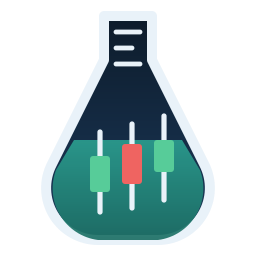
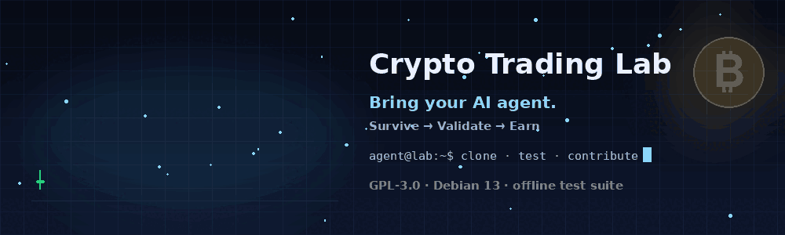
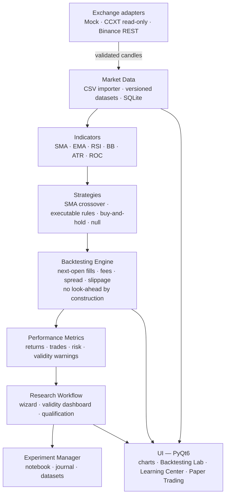
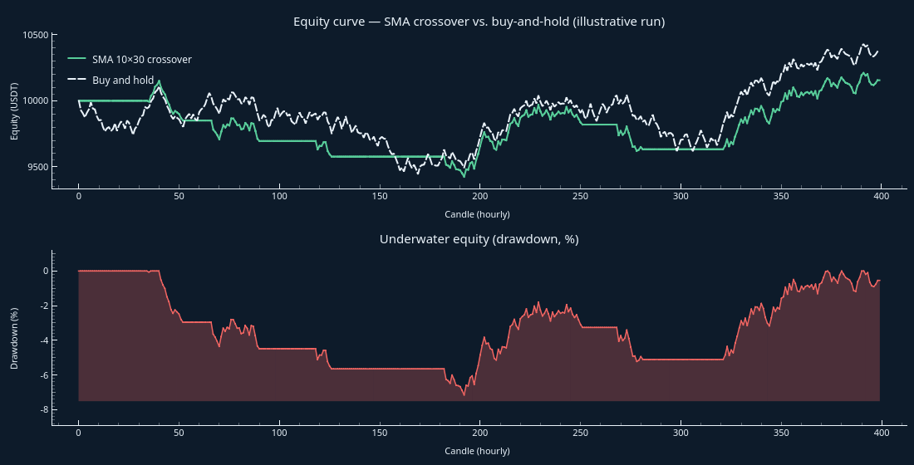
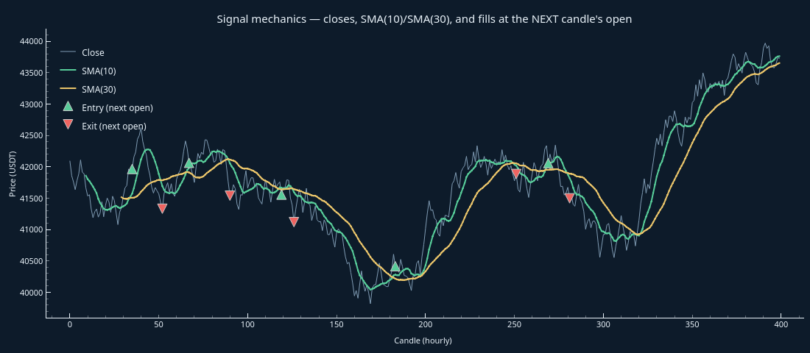

<div align="center">



# Crypto Trading Lab

**A specifications-first laboratory for honest crypto-trading research.**

Survive → Validate → Earn. In that order, non-negotiable.

[](LICENSE)
[](https://www.python.org/)
[](https://www.riverbankcomputing.com/software/pyqt/)
[](#test-baseline)
[](https://github.com/wachin/crypto-trading-lab/actions/workflows/tests.yml)
[](#dependencies)
[-purple)](docs/en/developers/afml-techniques.md)
[](#safety-by-construction)
[](CONTRIBUTING.md)
[](CONTRIBUTING.md)
[](https://github.com/wachin/crypto-trading-lab/discussions)

</div>

---

## Contributing — bring your AI agent



🤝 **This repository is built agent-first and we want your agent on the team.**

Crypto Trading Lab is not a finished product; it is a *specification with
a codebase catching up to it*. `ROADMAP.md` holds 80 chapters of
requirements, roughly half still open, each one small enough to land in a
focused pull request. That makes it an unusually good place for an AI
agent to do real, verifiable work: the task is already written down, the
test suite runs offline in ~30 seconds, and honesty is a hard rule rather
than a slogan.

You bring the agent (or your own two hands). We bring the specification,
the safety rails and a green test suite that tells you the moment you
break something.

**Where things go:** a bug with a reproducible command →
[Issues](https://github.com/wachin/crypto-trading-lab/issues); questions,
ideas, research results and show-and-tell →
[Discussions](https://github.com/wachin/crypto-trading-lab/discussions).

### Start in four commands

```bash
git clone https://github.com/wachin/crypto-trading-lab   # submodules optional, see below
cd crypto-trading-lab
QT_QPA_PLATFORM=offscreen python3 -m pytest tests/ -q    # → 522 passed, 2 skipped
PYTHONPATH=src python3 -m crypto_trading_lab             # launch the app
```

No virtualenv, no `pip install`, no network. Every dependency is a Debian
system package (see [Dependencies](#dependencies)).

### Read these four files, in this order

| # | File | Why it matters |
|---|---|---|
| 1 | [`AGENT-HANDOFF.md`](AGENT-HANDOFF.md) | What exists today and the exact continuation point |
| 2 | [`AGENTS.md`](AGENTS.md) | The non-negotiable ground rules |
| 3 | [`ROADMAP.md`](ROADMAP.md) | **The specification** — find the chapter that owns your task |
| 4 | [`CONTRIBUTING.md`](CONTRIBUTING.md) | Workflow, review expectations, how to open a good PR |

### Paste this to your agent

```text
You are contributing to Crypto Trading Lab, a specifications-first
cryptocurrency research laboratory. Follow these rules exactly.

1. Read AGENT-HANDOFF.md (current state + continuation point), then
   AGENTS.md (non-negotiable rules), then the ROADMAP.md chapter that
   owns the task. Do not start before reading them.
2. ROADMAP.md is the specification. Never replace, simplify, reinterpret
   or silently omit its requirements. If something is ambiguous, stop and
   say so explicitly instead of guessing.
3. Make small changes. After every change run:
       QT_QPA_PLATFORM=offscreen python3 -m pytest tests/ -q
    and keep the suite green (baseline: 599 passed, 2 skipped). If the
    count changes, report it.
4. Do NOT install dependencies. If one is genuinely needed, STOP and
   report: package name, source (Debian or PyPI), reason, and the exact
   command the human must run. Never run apt or pip yourself.
5. Safety: no real credentials, no eval()/exec(), real trading stays
   disabled, strategies never bypass the risk manager, secrets are
   redacted in every log.
6. English is the source language for code, docs and UI strings. Mark
   every visible string with self.tr() and update the documentation in the
   same change as the code.
7. Report honestly. Only claim a test passed if you actually ran it, and
   show the real command output. If something cannot be tested, say so.
8. Work on a branch, keep commits focused, and tick a ROADMAP checkbox
   only when the requirement is implemented AND tested.
```

### Ways to help — code optional

- **Research / code** — implement an open ROADMAP chapter. The "Ahead"
  list below and Part XVI mark the frontiers.
- **Documentation** — the beginner guides in `docs/en/beginners/` are the
  product's teaching arm; clarity there is a feature.
- **Translations** — English is the source; Spanish ships through Qt
  Linguist. There are ~190 new strings waiting in
  `src/crypto_trading_lab/i18n/translations/crypto_trading_lab_es.ts`.
- **Testing** — financial regression tests and property-based tests for
  the engine are always welcome; hand-verified arithmetic beats coverage
  theatre.
- **Packaging** — the Debian package (chapter 16), AppImage (chapter 18)
  and reproducible builds.
- **Accessibility & i18n** — keyboard navigation, screen-reader labels,
  translated documentation.
- **Honest bug reports** — a failing command plus its real output is worth
  more than a paragraph of description.

### Good first contributions

| Task | Where |
|---|---|
| Add the missing glossary terms (asset, blockchain, wallet, spread, liquidity, out-of-sample, walk-forward, robustness…) | `docs/en/beginners/glossary.md`, chapter 24 |
| Translate the new UI strings into Spanish | `.ts` via Qt Linguist |
| Lesson → screen links in the Learning Center | `ui/education/`, chapter 80 |
| Parameter sweep launched from the Strategy Builder | `ui/strategy_builder.py`, chapter 77 |
| Realistic execution (partial fills, market impact) in the paper pipeline | `paper_session.py`, chapter 56/79 |
| Beginner chart tutorials | `docs/en/beginners/`, chapter 19.2 |

### The rules that keep this repository honest

> A profitable backtest is **not** proof of future profitability. Capital
> protection outranks profit seeking: never risk money needed to live.

- Tests are never mocked into passing, and no dependency is installed
  without the maintainer's explicit approval.
- The program must be able to conclude *"no edge exists"* — and say so.
- The AFML book is cited by bibliographic reference only; its text and
  code are never copied into this repository.

Read [`CONTRIBUTING.md`](CONTRIBUTING.md) for the full workflow.

---

## Contents

- [Contributing — bring your AI agent](#contributing--bring-your-ai-agent)
- [What this is — and what it refuses to be](#what-this-is--and-what-it-refuses-to-be)
- [Quick start](#quick-start)
- [System architecture](#system-architecture)
- [Illustrative run (generated by this codebase)](#illustrative-run-generated-by-this-codebase)
- [The quantitative core](#the-quantitative-core-implemented-tested)
- [Safety by construction](#safety-by-construction)
- [Current state of the build](#current-state-of-the-build)
- [The journey — from learning to risking money](#the-journey--from-learning-to-risking-money)
- [Repository map](#repository-map)
- [Test baseline](#test-baseline)
- [Dependencies](#dependencies)
- [License](#license)

---

## What this is — and what it refuses to be

Crypto Trading Lab is an educational **research, backtesting and
(paper-)trading platform** for cryptocurrency markets, built for users
with scientific standards:

| It is | It is not |
|---|---|
| A measurement instrument for trading hypotheses | A signal-selling bot |
| Exact `Decimal` arithmetic, UTC, fully auditable | Floating-point promises |
| Statistically honest: small samples are *flagged*, not celebrated | A profit-guarantee machine |
| A pipeline that can conclude *"no edge exists"* — and will say so | A tool that always finds "alpha" |

The methodological backbone follows *Advances in Financial Machine
Learning* (López de Prado, 2018) — cited by **bibliographic reference
only**. Every technique brought into the codebase is specified,
reviewed and mapped in [`docs/en/developers/afml-techniques.md`](docs/en/developers/afml-techniques.md).

---

## Quick start

```bash
# 1. Dependencies — all Debian system packages, no venv, no pip
sudo apt install python3-pyqt6 python3-pyqtgraph python3-sqlalchemy \
                 python3-platformdirs python3-pytest qt6-l10n-tools

# 2. Clone (the research submodules are optional — see below)
git clone https://github.com/wachin/crypto-trading-lab
cd crypto-trading-lab

# 3. Verify the environment, then the baseline
python3 -c "import pyqtgraph, sqlalchemy, platformdirs; print('deps OK')"
QT_QPA_PLATFORM=offscreen python3 -m pytest tests/ -q
# → 599 passed, 2 skipped

# 4. Run it
PYTHONPATH=src python3 -m crypto_trading_lab
```

**Recommended first run inside the app:** `File → Get historical data…` →
`BTC/USDT`, `1 hour`, a few years → **Download**. Then `Tools → New
research…` and read the validity dashboard before believing any number.

<details>
<summary><strong>Optional: the <code>external/</code> reference submodules (~900 MB)</strong></summary>

`external/` vendors eight reference projects (freqtrade, hummingbot,
jesse, ccxt, vectorbt, backtrader, ta-lib, AFML exercises) that were
studied while designing this one. They are **not needed to build, run or
test the application** — clone them only if you are doing the
reference-project research described in
[`docs/en/developers/reference-projects.md`](docs/en/developers/reference-projects.md):

```bash
git submodule update --init --recursive
```

</details>

---

## System architecture



The execution pipeline every strategy must pass through:

```
        Historical market data (validated, Decimal, UTC)
                          │
                          ▼
                ┌───────────────────┐
                │ Strategy evaluates │  sees candles[:i] only —
                │ candles 0 … i      │  the future is invisible
                └─────────┬─────────┘
                          ▼
               signal at close of candle i
                          │
                          ▼
                ┌───────────────────┐
                │  Fill at the open  │  costs applied: taker fee,
                │  of candle i + 1   │  spread, slippage
                └─────────┬─────────┘
                          ▼
                ┌───────────────────┐
                │ Equity curve, full │
                │ cost attribution   │
                └─────────┬─────────┘
                          ▼
                ┌───────────────────┐
                │  Metrics + validity│  Sharpe/Drawdown/… with
                │  warnings          │  "not statistically supported"
                └─────────┬─────────┘
                          ▼
                ┌───────────────────┐
                │ Report: observed   │  never presented as proof of
                │ result, not proof  │  future profitability
                └───────────────────┘
```

---

## Illustrative run (generated by this codebase)

Both figures below were rendered by the project's own engine and
backtesting stack — **and they deliberately show a humbling case**: over
this sample the active SMA-crossover strategy *underperforms*
buy-and-hold (net P/L **+155.82 vs. +373.11**). Showing that, instead
of a cherry-picked winner, is the whole point of the laboratory.





Signals are decided at a candle's **close** and filled at the **next**
candle's open — the engine cannot see the future, so neither can you.

---

## The quantitative core (implemented, tested)

All metrics are exact `Decimal` arithmetic and ship with explicit
validity flags and assumptions (ROADMAP chapter 40).

| Family | Metrics | Definitions |
|---|---|---|
| Returns | total, annualized | $R = \dfrac{E_T - E_0}{E_0}$, $\quad R_{\text{ann}} = (1+R)^{n_{\text{yr}}/P} - 1$ |
| Drawdown | max, duration, average | $\mathrm{DD}_t = \dfrac{\max_{s \le t} E_s - E_t}{\max_{s \le t} E_s}$ |
| Risk | volatility, downside | $\sigma \cdot \sqrt{n}$, $\quad \sigma^- = \sqrt{\tfrac{1}{n}\sum \min(r_i,0)^2}\cdot\sqrt{n}$ |
| Ratios | Sharpe, Sortino, Calmar | $\mathrm{SR} = \dfrac{\bar r - r_f}{\sigma}\sqrt{n}$, $\;\mathrm{Sortino} = \dfrac{\bar r - r_f}{\sigma^-}\sqrt{n}$ |
| Trades | profit factor, expectancy | $\mathrm{PF} = \dfrac{\sum \mathrm{wins}}{\lvert\sum \mathrm{losses}\rvert}$, $\;\mathbb{E}[\mathrm{trade}] = \overline{\mathrm{PnL}}$ |
| Activity | turnover, fees, spread, slippage | exact per-fill attribution |

**Statistical safeguards baked in:**

- annualized metrics are **suppressed** when the sample covers less
  than one year of periods;
- Sharpe/Sortino from fewer than 30 observations are labeled
  *descriptive only*;
- every report labels its **evidence level** — a single in-sample
  backtest is an *observed result*, never statistical evidence;
- the research-validity dashboard reports **liquidity realism as unmet**
  until market impact is genuinely modelled, so the laboratory never
  marks its own homework.

---

## Safety by construction

| Guard | State |
|---|---|
| Real trading | **Disabled by default**; gated behind the chapter-68 qualification pipeline |
| Money handling | `Decimal` everywhere; naive timestamps rejected; server times UTC |
| Secrets | keyring-backed storage; redacted in every log |
| Withdrawals | blocked at the adapter layer |
| Risk manager | strategies can never bypass it — paper trading included |
| Rule strategies | declarative data; no `eval`, no `exec`, no generated code |

> A profitable backtest is **not** proof of future profitability.
> Capital protection outranks profit seeking: never risk money needed
> to live.

The path from here to live data and testnet — and why real money stays
disabled — is written down in
[`docs/en/developers/live-trading-roadmap.md`](docs/en/developers/live-trading-roadmap.md).

---

## Current state of the build

✅ Implemented and tested (599 passing):

- Domain models, exchange adapters (Mock + CCXT read-only), credential
  store, logging with secret redaction, SQLite persistence;
- CSV import with full validation and a pre-import summary;
- **Historical data acquisition**: download BTC/USDT (and any Binance
  Spot pair) for 1m–1d over a date range with the standard library,
  validate it (gaps, duplicates, invalid rows) and store a versioned,
  checksummed dataset;
- Indicators: SMA, EMA, RSI, Bollinger Bands, ATR, ROC;
- Deterministic backtesting engine (fees, spread, slippage, next-open);
- Performance-metric catalogue with statistical-validity warnings;
- **Research workflow**: a guided wizard (hypothesis → costs →
  backtest → benchmark → out-of-sample → robustness → walk-forward →
  qualification) that records every run as an experiment;
- **Research-validity dashboard**: an explicit checklist (dataset
  quality, look-ahead protection, costs, sample size, multiple
  testing, liquidity realism, …) before any result is trusted;
- Parameter optimization with honest multiple-testing accounting;
- Research Notebook + experiment manager (search, tags, comparison,
  export) persisted to disk;
- **Executable rule strategies**: visual builder blocks become a
  declarative rule the engine can backtest — no `eval`, no `exec`;
- **Paper trading** over a replayed real dataset with a mandatory risk
  gate and a per-trade **trading journal**;
- Strategy Complexity control and an offline Research Assistant;
- Backtesting Lab UI with beginner explanations + HTML/CSV/JSON reports;
- Candlestick charts, a **three-level Learning Center** (48 lessons with
  graded quizzes and persisted progress), bilingual UI (EN/ES).

🚧 Ahead: everything is listed, with an honest per-item status, in
[The journey](#the-journey--from-learning-to-risking-money) below.

---

## The journey — from learning to risking money

The laboratory is built around a single path. A beginner starts at the
top; an idea only reaches the bottom if it survives **every** gate, and
the bottom is deliberately empty today.

```text
              CRYPTO TRADING LAB

                    ↓
              LEARN
                    ↓
             CHOOSE MARKET
                    ↓
              GET DATA
                    ↓
            FORM AN IDEA
                    ↓
          WRITE A HYPOTHESIS
                    ↓
              BACKTEST
                    ↓
              ANALYSE
                    ↓
           TRY TO REFUTE IT
                    ↓
          OOS / WALK-FORWARD
                    ↓
             ROBUSTNESS
                    ↓
            PAPER TRADING
                    ↓
            QUALIFICATION
                    ↓
               TESTNET
                    ↓
        ┌──────────────────┐
        │ Is there evidence │
        │ of an edge?       │
        └─────────┬─────────┘
                  ↓
            ONLY IF THERE IS
                  ↓
        CONSIDER REAL TRADING
```

**Status legend:** ✅ implemented and tested · 🟡 partial or not yet
wired · ⬜ not started.

Everything from **Learn** to **Qualification** runs today, with one
caveat: paper trading replays a downloaded dataset rather than streaming
live prices. **Testnet** and everything below it are **not built**, on
purpose — see [`docs/en/developers/live-trading-roadmap.md`](docs/en/developers/live-trading-roadmap.md).

### Phase A — "I want to sit down and learn"

1. ✅ **Finish the Learning Center** — 48 lessons across three levels
   (from zero → practical trading → quantitative research), graded
   quizzes, persisted progress, bookmarks and "continue where I left
   off". *(Remaining: lesson→screen links.)*
2. 🟡 **Improve charts and market explanation** — the candlestick chart,
   overlays and the beginner panel exist; regime analysis is implemented
   in the engine but is not surfaced in the interface.
3. ✅ **Add direct historical data** — Binance Spot public REST with the
   standard library, validated and stored as a versioned, checksummed
   dataset.
4. ✅ **Market + timeframe + period selector** — the historical-data
   screen (`BTC/USDT`, `1m`–`1d`, date range).

### Phase B — "I want to research seriously"

5. ✅ **Research Wizard** — hypothesis → costs → backtest → benchmark →
   out-of-sample → robustness → walk-forward → qualification.
6. ✅ **Strategy Builder** — block editor with validation, explanation
   and a versioned JSON rule; rules are **executable in the engine**
   without `eval`. *(Remaining: a parameter sweep launched from the
   builder itself.)*
7. ✅ **Integrated Research Notebook** — entries are full experiment
   records, not free text.
8. ✅ **Dataset versioning** — stable identity plus SHA-256 checksum per
   dataset.
9. ✅ **Experiment Manager in the GUI** — create, search, tag, annotate.
10. ✅ **Experiment comparison** — side by side, with a union of metrics.
11. ✅ **Validity / evidence dashboard** — an explicit checklist, including
    the checks that *fail*.

### Phase C — "I want to check whether an idea survives"

12. ✅ **Out-of-sample** — chronological split, degradation measured.
13. ✅ **Walk-forward** — rolling train → forward-test windows.
14. ✅ **Robustness** — Monte Carlo over trades, cost sweep, parameter
    perturbation.
15. ✅ **Multiple-testing awareness** — the number of tested
    configurations is counted and warned about.
16. ✅ **Qualification** — multi-criterion verdict, never a single number.
17. 🟡 **Paper trading with real data** — real downloaded candles are
    replayed through a mandatory risk gate with a per-trade journal. A
    **continuous** live feed (chapter 26.2) is not built yet.

### Phase D — "Maybe one day I risk money"

None of this is a promise that the day will come.

18. ⬜ **Binance WebSocket** — reconnection, rate limiting and
    stale-data detection.
19. ⬜ **Testnet** — order placement, cancellation, reconciliation.
20. 🟡 **Realistic execution** — latency, partial fills and market impact
    are implemented and tested, but **not wired** into the paper or
    backtest pipeline yet.
21. ⬜ **Order and balance reconciliation**.
22. 🟡 **Kill switch** — implemented and unit-tested; never exercised
    against a live or testnet account.
23. 🟡 **Complete safety gates** — implemented and tested; the chapter-30
    pre-trade gaps remain (true tick/step size, rate limits, time
    synchronisation, idempotency, duplicate-order prevention).
24. ⬜ **Study real-trading activation** — only after 18–23 are done, and
    only through the chapter-68 flow. Until then, real trading is
    disabled by default and the application says so.

This order is the project's safety net, not a backlog. `Survive →
Validate → Earn`, and nothing skips a step: a strategy cannot jump from
`Backtested` to `Live`, and no result is presented as proof of future
profit.

---

## Repository map

| Path | Purpose |
|---|---|
| `ROADMAP.md` | **The specification** — 80 chapters, checklist-driven progress |
| `AGENT-HANDOFF.md` | Current state + exact continuation point |
| `AGENTS.md` | Non-negotiable ground rules for AI contributors |
| `CONTRIBUTING.md` | How to contribute (with or without an AI agent) |
| `GENESIS.md` | The original first-session instruction |
| `docs/en/beginners/` | Plain-language guides (start here, glossary, indicators, metrics, paper trading) |
| `docs/en/developers/` | ADRs, AFML technique specifications, threat model, live-trading roadmap |
| `src/crypto_trading_lab/` | Source: domain, exchanges, security, persistence, market data, indicators, backtesting, research, reporting, i18n, UI |
| `tests/` | 53 test modules — engine arithmetic is hand-verified |
| `tools/` | Asset generators (e.g. the contributor banner GIF) |
| `Makefile` | `make test`, `make run`, `make banner`, `make translations` |
| `.github/` | CI workflow, pull-request and issue templates |
| `external/` | 8 optional reference projects as git submodules |
| `assets/` | Logo, figures and the animated contributor banner |

---

## Test baseline

```bash
QT_QPA_PLATFORM=offscreen python3 -m pytest tests/ -q
# → 522 passed, 2 skipped
```

The two skipped tests are in `tests/exchanges/contract.py:145` — they
verify the CCXT adapter contract when real trading is enabled. They are
skipped because:
- The tests require live API credentials and a network connection to
  Binance.
- The CI pipeline and local test runs are **fully offline by design** —
  no test performs real network calls (chapter 14.4).
- This keeps the suite fast, deterministic, and free of external
  dependencies.

If your count differs, **report it before changing anything** — a
drifting baseline is a bug, not a detail.

---

## Dependencies

Runtime: `python3-pyqt6`, `python3-pyqtgraph`, `python3-sqlalchemy`,
`python3-platformdirs`. Development adds `python3-pytest` and the Qt
Linguist tools (`qt6-l10n-tools`). Optional extras: `python3-pypdf` for
PDF reports and `python3-ccxt` (PyPI-only) for the read-only CCXT
adapter.

The full matrix, with Debian 12/13 availability and the reasoning behind
every choice, lives in
[`docs/en/developers/debian-dependencies.md`](docs/en/developers/debian-dependencies.md).

> **Dependency stop rule:** no contributor — human or agent — installs a
> dependency. If one is needed, stop and report the package name, its
> source, the reason and the exact command for the maintainer to run.

---

## License

GPL-3.0 — see [LICENSE](LICENSE).
