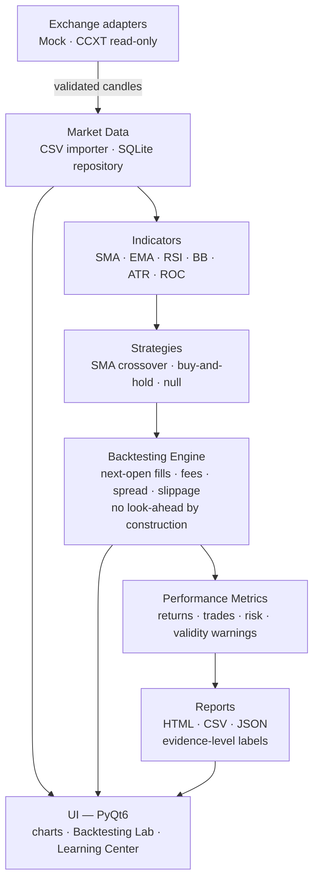

<div align="center">


# Crypto Trading Lab

**A specifications-first laboratory for honest crypto-trading research.**
Survive → Validate → Earn. In that order, non-negotiable.

[](LICENSE)
[](https://www.python.org/)
[](https://www.riverbankcomputing.com/software/pyqt/)
[](#test-baseline)
[](#dependencies)
[-purple)](docs/en/developers/afml-techniques.md)
[](#safety-by-construction)

</div>

---

## What this is — and what it refuses to be

Crypto Trading Lab is an educational **research, backtesting and
(paper-)trading platform** for cryptocurrency markets, built for users
with scientific standards:

| It is | It is not |
|---|---|
| A measurement instrument for trading hypotheses | A signal-selling bot |
| Exact `Decimal` arithmetic, UTC, fully auditable | Floating-point promises |
| Statistically honest: small samples are *flagged*, not celebrated | A profit-guarantee machine |
| A pipeline that can conclude *"no edge exists"* — and will say so | A tool that always finds "alpha" |

The methodological backbone follows *Advances in Financial Machine
Learning* (López de Prado, 2018) — cited by **bibliographic reference
only**. Every technique brought into the codebase is specified,
reviewed and mapped in [`docs/en/developers/afml-techniques.md`](docs/en/developers/afml-techniques.md).

---

## System architecture



The execution pipeline every strategy must pass through:

```
        Historical market data (validated, Decimal, UTC)
                          │
                          ▼
                ┌───────────────────┐
                │ Strategy evaluates │  sees candles[:i] only —
                │ candles 0 … i      │  the future is invisible
                └─────────┬─────────┘
                          ▼
               signal at close of candle i
                          │
                          ▼
                ┌───────────────────┐
                │  Fill at the open  │  costs applied: taker fee,
                │  of candle i + 1   │  spread, slippage
                └─────────┬─────────┘
                          ▼
                ┌───────────────────┐
                │ Equity curve, full │
                │ cost attribution   │
                └─────────┬─────────┘
                          ▼
                ┌───────────────────┐
                │  Metrics + validity│  Sharpe/Drawdown/… with
                │  warnings          │  "not statistically supported"
                └─────────┬─────────┘
                          ▼
                ┌───────────────────┐
                │ Report: observed   │  never presented as proof of
                │ result, not proof  │  future profitability
                └───────────────────┘
```

---

## Illustrative run (generated by this codebase)

Both figures below were rendered by the project's own engine and
backtesting stack — **and they deliberately show a humbling case**: over
this sample the active SMA-crossover strategy *underperforms*
buy-and-hold (net P/L **+155.82 vs. +373.11**). Showing that, instead
of a cherry-picked winner, is the whole point of the laboratory.


Signals are decided at a candle's **close** and filled at the **next**
candle's open — the engine cannot see the future, so neither can you.

---

## The quantitative core (implemented, tested)

All metrics are exact `Decimal` arithmetic and ship with explicit
validity flags and assumptions (ROADMAP chapter 40).

| Family | Metrics | Definitions |
|---|---|---|
| Returns | total, annualized | $R = \dfrac{E_T - E_0}{E_0}$, $\quad R_{\text{ann}} = (1+R)^{n_{\text{yr}}/P} - 1$ |
| Drawdown | max, duration, average | $\mathrm{DD}_t = \dfrac{\max_{s \le t} E_s - E_t}{\max_{s \le t} E_s}$ |
| Risk | volatility, downside | $\sigma \cdot \sqrt{n}$, $\quad \sigma^- = \sqrt{\tfrac{1}{n}\sum \min(r_i,0)^2}\cdot\sqrt{n}$ |
| Ratios | Sharpe, Sortino, Calmar | $\mathrm{SR} = \dfrac{\bar r - r_f}{\sigma}\sqrt{n}$, $\;\mathrm{Sortino} = \dfrac{\bar r - r_f}{\sigma^-}\sqrt{n}$ |
| Trades | profit factor, expectancy | $\mathrm{PF} = \dfrac{\sum \text{wins}}{\lvert\sum \text{losses}\rvert}$, $\;\mathbb{E}[\text{trade}] = \bar{\text{P\&L}}$ |
| Activity | turnover, fees, spread, slippage | exact per-fill attribution |

**Statistical safeguards baked in:**

- annualized metrics are **suppressed** when the sample covers less
  than one year of periods;
- Sharpe/Sortino from fewer than 30 observations are labeled
  *descriptive only*;
- every report labels its **evidence level** — a single in-sample
  backtest is an *observed result*, never statistical evidence.

---

## Safety by construction

| Guard | State |
|---|---|
| Real trading | **Disabled by default**; gated behind the chapter-68 qualification pipeline |
| Money handling | `Decimal` everywhere; naive timestamps rejected; server times UTC |
| Secrets | keyring-backed storage; redacted in every log |
| Withdrawals | blocked at the adapter layer |
| Risk manager | strategies can never bypass it |

> A profitable backtest is **not** proof of future profitability.
> Capital protection outranks profit seeking: never risk money needed
> to live.

---

## Current state of the build

✅ Implemented and tested (255 passing):

- Domain models, exchange adapters (Mock + CCXT read-only), credential
  store, logging with secret redaction, SQLite persistence;
- CSV import with full validation and a pre-import summary;
- Indicators: SMA, EMA, RSI, Bollinger Bands, ATR, ROC;
- Deterministic backtesting engine (fees, spread, slippage, next-open);
- Performance-metric catalogue with statistical-validity warnings;
- Backtesting Lab UI with beginner explanations + HTML/CSV/JSON
  reports;
- Candlestick charts, Learning Center, bilingual UI (EN/ES).

🚧 Ahead: benchmarking views (ch. 42), robustness testing (43–46),
paper trading (57), risk manager (58), qualification pipeline (66–68).

---

## Repository map

| Path | Purpose |
|---|---|
| `ROADMAP.md` | **The specification** — 72 chapters, checklist-driven progress |
| `AGENT-HANDOFF.md` | Current state + exact continuation point |
| `AGENTS.md` | Non-negotiable ground rules for AI contributors |
| `GENESIS.md` | The original first-session instruction |
| `docs/en/beginners/` | Plain-language guides (start here, glossary, indicators, metrics) |
| `docs/en/developers/` | ADRs, AFML technique specifications, reference-project studies |
| `src/crypto_trading_lab/` | Source: domain, exchanges, security, persistence, market data, indicators, backtesting, reporting, i18n, UI |
| `tests/` | 41 test modules — engine arithmetic is hand-verified |
| `external/` | 8 reference projects as git submodules (freqtrade, hummingbot, jesse, ccxt, vectorbt, backtrader, ta-lib, AFML exercises) |
| `assets/` | Logo and figures (SVG sources rendered to PNG) |

## Test baseline

```bash
QT_QPA_PLATFORM=offscreen python3 -m pytest tests/ -q
# → 255 passed, 2 skipped
```

## Running

```bash
# dependencies are all Debian system packages (no venv):
sudo apt install python3-pyqt6 python3-pyqtgraph python3-sqlalchemy \
                 python3-platformdirs python3-pytest qt6-l10n-tools

git clone --recurse-submodules https://github.com/wachin/crypto-trading-lab
cd crypto-trading-lab
PYTHONPATH=src python3 -m crypto_trading_lab
```

## Contributing

This repository is built agent-first: read `AGENT-HANDOFF.md`, then
`AGENTS.md`, then the relevant `ROADMAP.md` chapter. Small changes,
tests always run, honesty over hype.

## License

GPL-3.0 — see [LICENSE](LICENSE).
